# PARAFAC2 AO-ADMM: Constraints in all modes
## Supplementary material

### Code
The libraries developed as part of this project is available on the [tensorkit](https://github.com/marieroald/tensorkit) and [bcd_tensorkit](https://github.com/MarieRoald/bcd_tensorkit) repositories. To install the relevant code, run the following lines

```
pip install git+https://github.com/MarieRoald/TensorKit.git@6faff50077fef2f47be9c5fdbec41bc8b16b7ec5
pip install git+https://github.com/MarieRoald/bcd_tensorkit.git@49b8fc40e3aa45b9567b11175f30d18d745a3c56
pip install condat_tv tqdm
```

### Stopping tolerances
Both the relative and absolute stopping tolerance was set to 1E-10 for all experiments.


### Additional information about experiments
#### Setup (1): Non-negativity
Boxplots showing the FMS and time spent until convergence with the AO-ADMM algorithm, flexible coupling with hierarchical least squares (HALS) and the traditional ALS algorithm is shown below. We have also included plots showing convergence for both noise levels.

<table>
<tr>
<td></td>
</tr>
<tr>
<td>FMS for the different algorithms with non-negativity constraints.</td>
</tr>
</table>

<table>
<tr>
<td></td>
</tr>
<tr>
<td>Time required for convergence with the different algorithms.</td>
</tr>
</table>

<table>
<tr>
<td></td>
<td></td>
<td></td>
</tr>
<tr><td colspan="3">Plots showing the convergence (on a logarithmic y-scale) of the different algorithms fitted to data with noise level=0.33. The lines show the median performance across all 50 datasets and the shaded areas show the inter-quartile range.</td></tr>
</table>

<table>
<tr>
<td></td>
<td></td>
<td></td>
</tr>
<tr><td colspan="3">Plots showing the convergence (on a logarithmic y-scale) of the different algorithms fitted to data with noise level=0.5. The lines show the median performance across all 50 datasets and the shaded areas show the inter-quartile range.</td></tr>
</table>


#### Setup (2): Graph Laplacian regularisation
To generate the components, we fit a 3 component CP model to the [Aminoacids](http://www.models.life.ku.dk/amino_acid_fluo) dataset made publicly available by Rasmus Bro. We used the Emission-mode components as the blueprint for the PARAFAC2 components, shifting them cyclically to obtain the evolving factor matrices.

For the grid-search, we tested 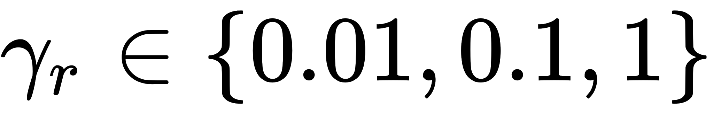 and 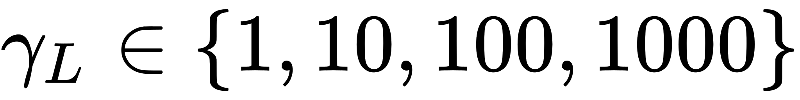. The optimal regularisation parameters were 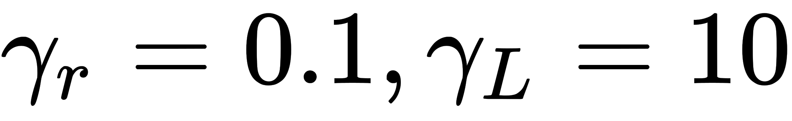 for 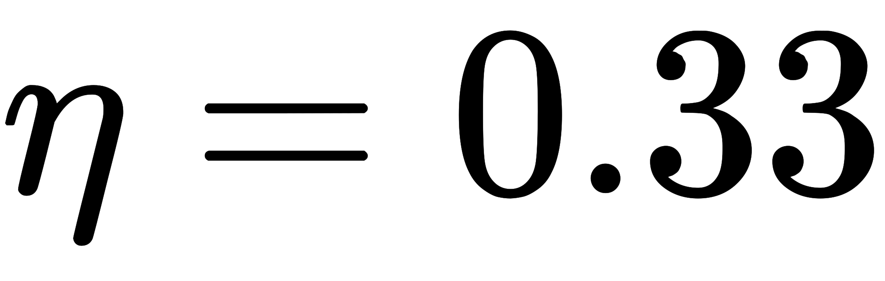 and  for 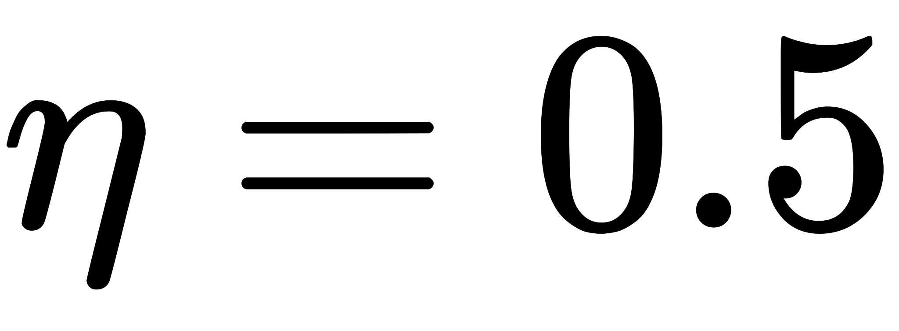. We observed that for lower ridge regularisation on the non-evolving modes, the model needed higher graph Laplacian based regularisation on the evolving mode to obtain similar FMS. For both noise levels, the experiments with ridge coefficient of 1 and Laplacian regularisation strength of 1000 resulted in all-zero factor matrices. The boxplots below illustrate these results.


<table>
<tr>
<td>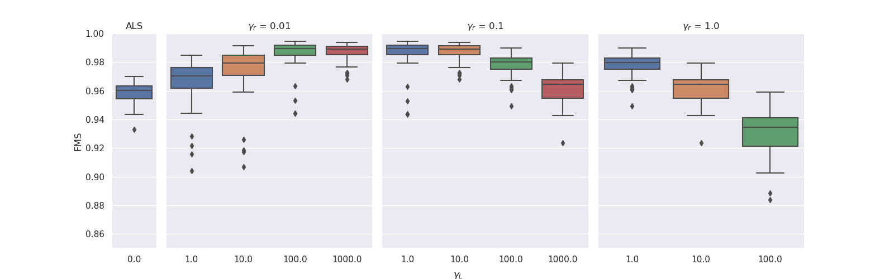</td>
</tr>
<tr>
<td>Results for noise level 0.33. The experiments with ridge coefficient of 1 and Laplacian regularisation strength of 100 had one outlier that obtained an FMS less than 0.6.</td>
</tr>
</table>

<table>
<tr>
<td>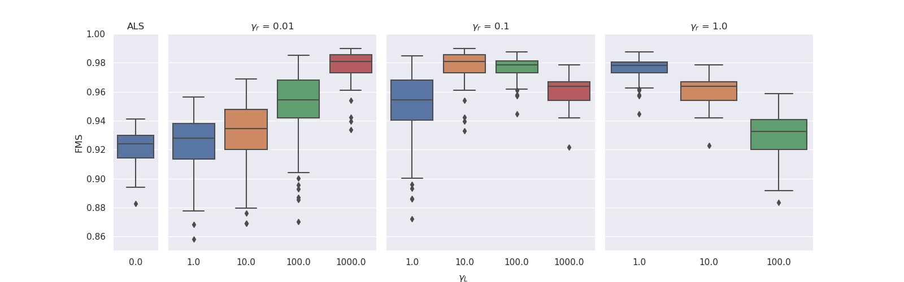</td>
</tr>
<tr>
<td>Results for noise level 0.5. The experiments with ridge coefficient of 1 and Laplacian regularisation strength of 100 had one outlier that obtained an FMS less than 0.6.</td>
</tr>
</table>

To evaluate the results, we also created animated plots of the estimated factor matrices. Below, we see the component plots from both noise levels for one of the simulated datasets. 

<table>
<tr>
<td>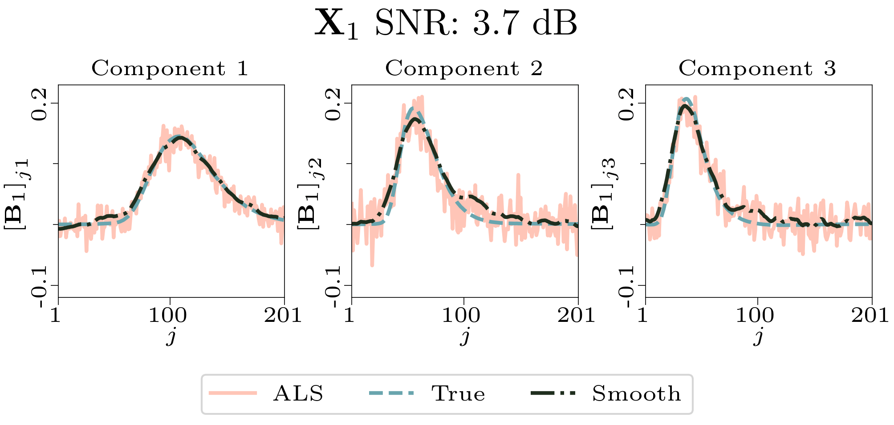</td>
</tr>
<tr>
<td>Component plot for one of the datasets and noise level 0.33.</td>
</tr>
</table>

<table>
<tr>
<td></td>
</tr>
<tr>
<td>Component plot for one of the datasets and noise level 0.5.</td>
</tr>
</table>


#### Setup (3): TV regularisation
To generate piecewise constant components with jumps that sum to zero, we used the algorithm described in the following function:
```python
def random_piecewise_constant_vector(length, num_jumps):
    # Initialise a vector of zeros with `length/2` elements:
    derivative = np.zeros(length//2)  # // is integer divison, so 3//2 = 1, not 1.5

    # Set the first `num_jumps/2` elements of the derivative vector to a random number:
    derivative[:num_jumps//2] = np.random.standard_normal(size=num_jumps//2)
    
    # Concatenate the derivative vector with itself multiplied by -1 to obtain  
    derivative = np.concatenate([derivative, -derivative])
    
    # Shuffle the derivative vector
    np.random.shuffle(derivative)  # `np.random.shuffle` modifies its input

    # Generate piecewise constant function by taking the cumulative sum of the sparse derivative vector
    piecewise_constant_function = np.cumsum(derivative)
    
    # Add a random offset to this function
    piecewise_constant_function += np.random.standard_normal()

    return piecewise_constant_function
```

For the grid search with TV regularisation, we tested 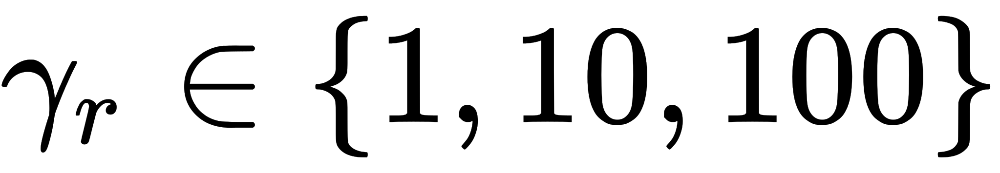 and 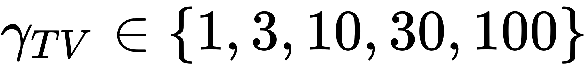. The optimal regularisation parameters were 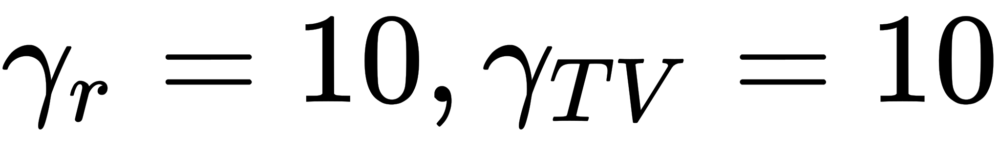 for  and  for . Again, we observed that a lower ridge regularisation strength required a higher degree of TV regularisation to obtain similar results. The boxplots below illustrate this.

<table>
<tr>
<td>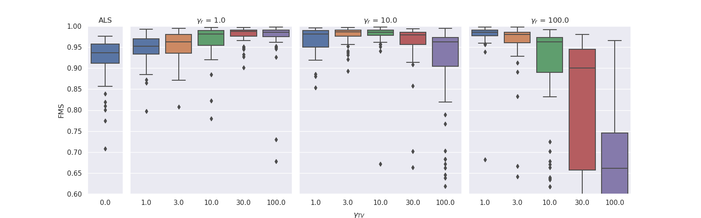</td>
</tr>
<tr>
<td>Results for noise level 0.33. There were no cropped outliers for any of the parameter combinations except for those with clipped wiskers.</td>
</tr>
</table>

<table>
<tr>
<td>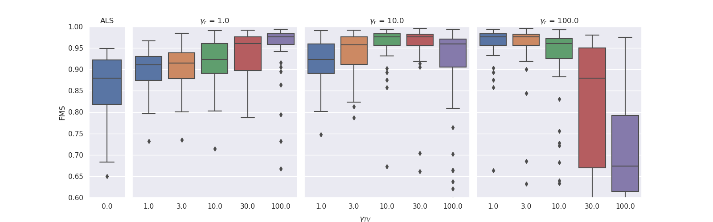</td>
</tr>
<tr>
<td>Results for noise level 0.5. There were only one cropped outliers for the parameter combinations without clipped wiskers, specifically, there were one outlier for ridge level 100 and a TV regularisation strength of 10.</td>
</tr>
</table>

We created animated plots of the estimated factor matrices. Below, we see the component plots from both noise levels for one of the simulated datasets. 

<table>
<tr>
<td>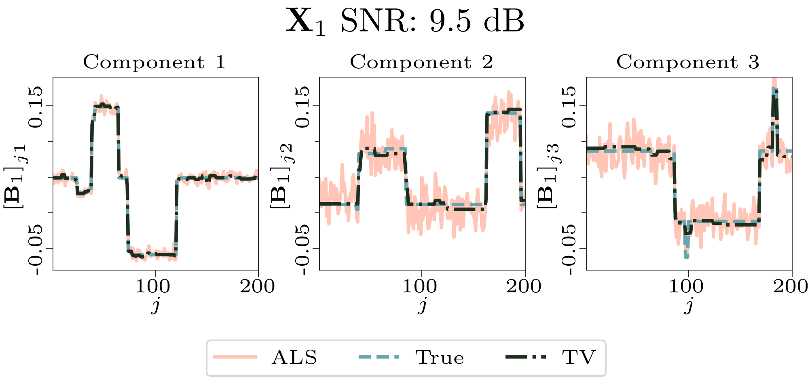</td>
</tr>
<tr>
<td>Component plot for one of the datasets and noise level 0.33.</td>
</tr>
</table>

<table>
<tr>
<td>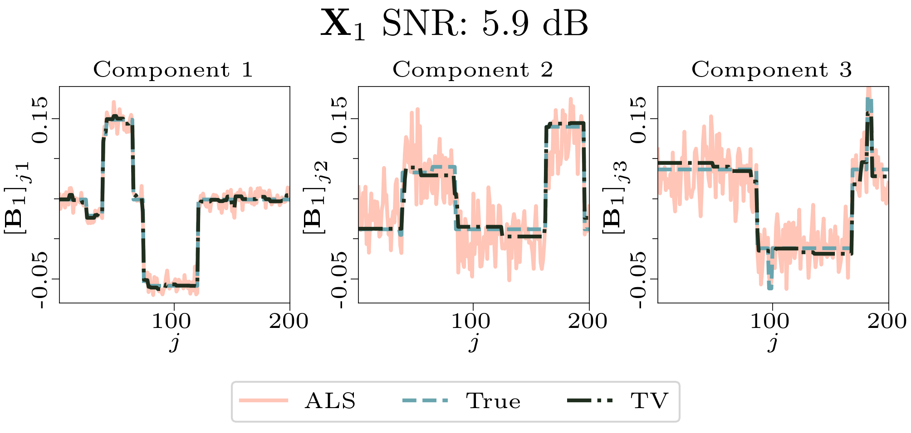</td>
</tr>
<tr>
<td>Component plot for one of the datasets and noise level 0.5.</td>
</tr>
</table>
